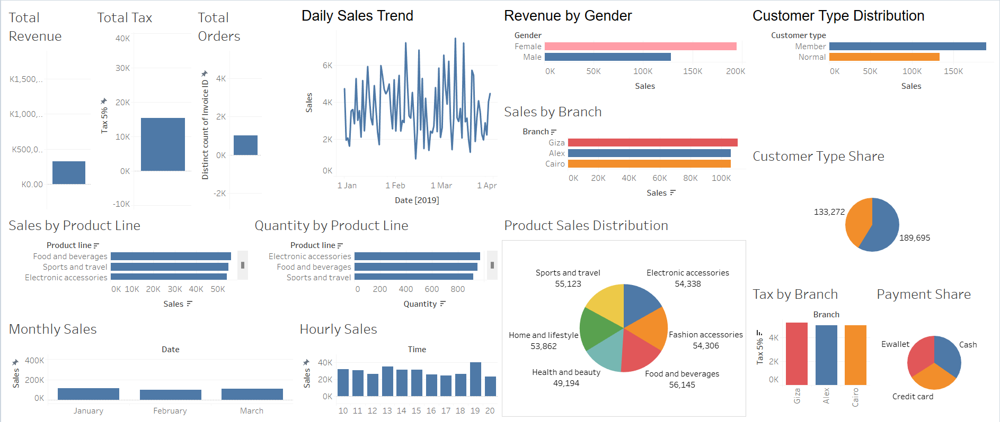

# 📊 Ecommerce Supermarket Analytics

A data analytics project built using SQL and Tableau to uncover key business insights from a retail supermarket dataset. Designed for business decision-makers and recruiters to showcase data-driven storytelling skills.

---

## 🚀 Project Overview

This project analyzes sales transactions of a supermarket using SQL and Tableau to derive insights on customer behavior, product performance, revenue trends, and branch comparisons.

---

## 🎯 Business Goals

- Understand peak sales hours and days
- Analyze product line performance
- Profile customers by type and gender
- Compare revenue and profit across branches
- Visualize payment preferences
- Provide data-driven recommendations

---

## 📈 Key KPIs & Questions

- 🧾 Total Revenue, Orders, Gross Income
- 📦 Which product lines perform best?
- 👥 How do different customer types behave?
- ⏰ When is the highest sales traffic?
- 🏢 Which branches are most profitable?
- 💳 What are the most used payment methods?

---

## 🛠 Tools Used

- SQL (for data exploration and cleaning)
- Tableau Public (for interactive dashboards)
- Excel/CSV (initial dataset formatting)
- GitHub (project documentation)

---

## 📊 Tableau Dashboard

📌 [View on Tableau Public](https://public.tableau.com/app/profile/sumanchakraborty/vizzes)  
Includes multiple pages:
- Executive Summary
- Product Analytics
- Customer Analysis
- Time Trends
- Branch Comparison
- Payment Method
- Key Insights

---

## 💡 Key Insights

- 🕒 **Evening hours (5–8 PM)** generate **40%+ of revenue**
- 🧍‍♂️ **Members spend 20–25% more** than Normal customers
- 🏢 **Branch C** outperforms Branch A & B by **15–20%**
- 🛒 **Food & Beverages** is the top-selling product line
- 💳 **Ewallets** are the most popular payment method

See full insights: [`insights_summary.md`](./insights_summary.md)

---
